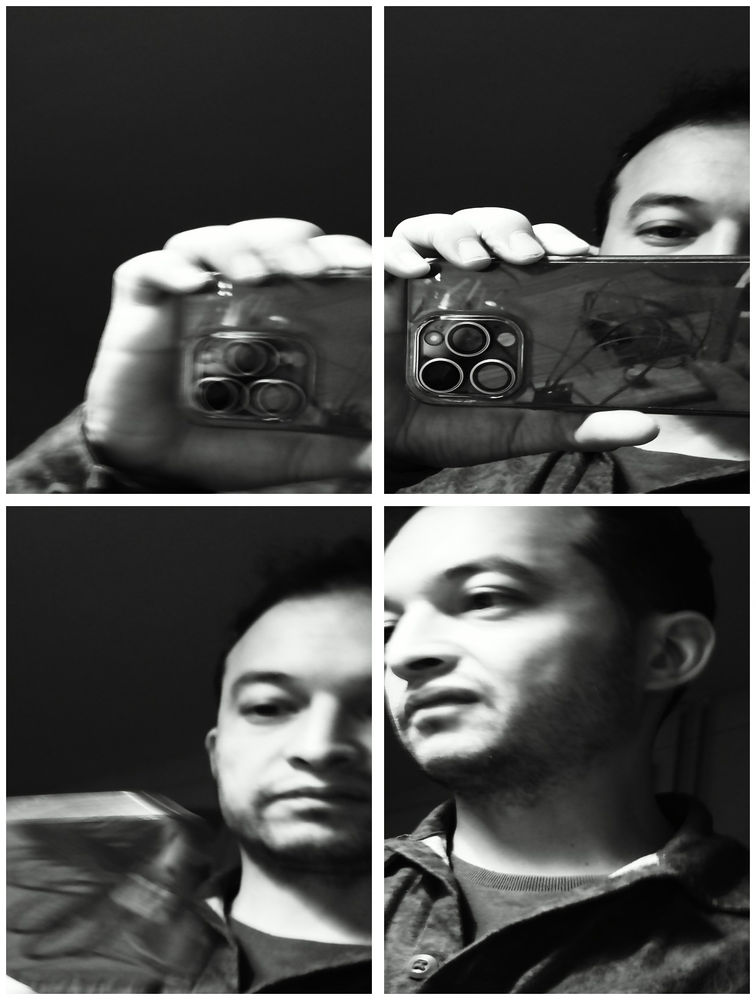
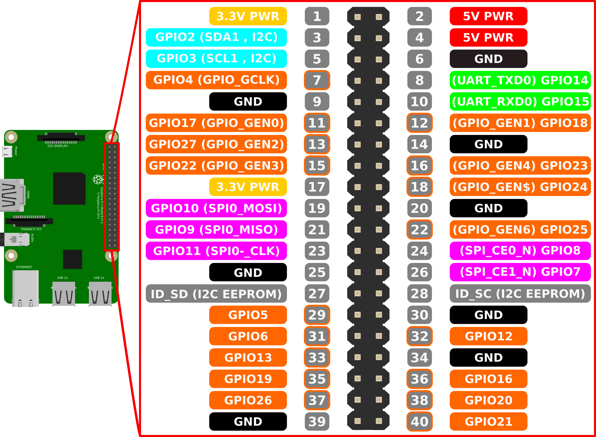

# 📸 Pi Photobooth

**Pi Photobooth** is a simple DIY photo booth system built with Raspberry Pi, controlled by physical buttons and GPIO pins. It captures 4 photos in sequence and creates a final montage image, all with visual feedback using LEDs. A dedicated shutdown button ensures safe power-off.

> 🧾 The user experience is inspired by vintage analog photo booths:
> - A single button launches the photo session.
> - Four different photos are taken with a visible lamp (relay-based flash).
> - Output is high-contrast black and white, resembling silver gelatin prints.



---

## 🔧 Hardware Requirements

- Raspberry Pi (any model with GPIO and camera support)
- Raspberry Pi Camera (official CSI camera or USB camera)
- 2 Push Buttons:
  - Photo trigger → GPIO 22 to GND
  - Shutdown button → GPIO 18 to GND
- 2 LEDs with resistors:
  - Red LED (with relay to flash lamp) → GPIO 27
  - Green LED → GPIO 17
- 5V Relay Module (connected to GPIO 27 and flash lamp)
- Breadboard and jumper wires
- External lamp (optional, used as flash)

---

## ⚙️ GPIO Pin Usage

| GPIO | Function           |
|------|--------------------|
| 22   | Trigger button     |
| 18   | Shutdown button    |
| 27   | Red LED + relay    |
| 17   | Green LED          |




---

## 🛠 Software Installation

```bash
sudo apt update
sudo apt install -y python3-rpi.gpio libcamera-utils imagemagick gpiod nginx
```

Enable the camera interface with:

```bash
sudo raspi-config
# Interface Options > Camera > Enable
# Reboot afterwards
```

---

## 🌐 Web Server (Nginx)

Photos are saved in:

```
/var/www/html/
```

To make them accessible via browser:

```bash
sudo apt install nginx
sudo systemctl enable nginx
sudo systemctl start nginx
```

Then access via:

```
http://raspberrypi.local/
```

Ensure permissions are correct:

```bash
sudo chown -R pi:www-data /var/www/html/
sudo chmod -R 775 /var/www/html/
```


index file : index.php

```bash
cp index.php /var/www/html/index.php
```

---

## 💡 Planned Features

- 📨 Download, email, or delete images from the browser interface (coming soon)
- 🖨️ Install a thermal printer to auto-print final montage (future development)

---

## 📁 Project Structure

Place everything in:

```
/home/pi/pi-photobooth/
```

Files:
- `bouton.py` – main GPIO controller
- `cab4.sh` – photo capture and montage script
- `bouton.service` – systemd unit to run `bouton.py` on boot
- `install.sh` – optional installer

---

## 🚀 Installation (Automated)

```bash
chmod +x install.sh
./install.sh
```

This will:
- Copy the systemd service
- Enable it to launch on boot
- Allow passwordless shutdown for user `pi`

---

## 🔍 Monitoring

```bash
journalctl -u bouton.service -f
```

---

## 🛑 Safe Shutdown

Press the shutdown button connected to GPIO 18 to power off safely.

---

## 📂 Example Output

- 4 separate images: `image_*.jpg`
- Final montage: `final_*.jpg`

---

Enjoy your DIY photobooth! 🎉